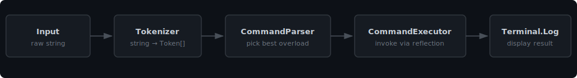
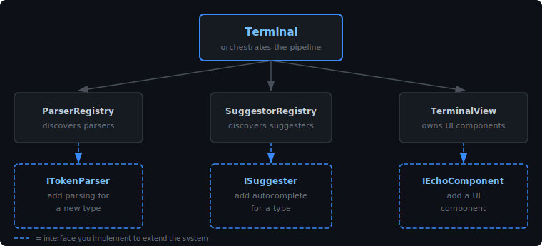

# Echo Terminal

[](https://unity.com)
[](https://learn.microsoft.com/en-us/dotnet/csharp/)
[](https://opensource.org/licenses/Apache-2.0)

A developer console for Unity 6 -- runtime and editor!

## Contents

- [Features](#features)
- [Getting Started](#getting-started)
  - [Requirements](#requirements)
  - [Installation](#installation)
  - [Add the terminal to a scene](#add-the-terminal-to-a-scene)
  - [Your first command](#your-first-command)
- [Architecture](#architecture)
- [Customizing](#customizing)
  - [Custom type parser](#custom-type-parser)
  - [Custom autocomplete](#custom-autocomplete)
  - [Target GameObjects by name](#target-gameobjects-by-name)
  - [Custom UI component](#custom-ui-component)
  - [Custom highlighting theme](#custom-highlighting-theme)
  - [Group and toggle commands](#group-and-toggle-commands)
  - [Changing inputs](#changing-inputs)
- [Contributing](#contributing)
- [Support Me](#support-me)

### Developer message

I kept seeing paid dev consoles and thinking - why isn’t there a free one that’s actually well built? So I took some time and made this. No price tag, no bloat, just a clean lib you can read, own, and actually understand.

Every layer is yours. Keep the default UI, swap out just the parts you don’t like, or gut the whole thing and wire the backend into something completely your own. The tokenizer, the parser, the suggesters, the highlighting - all of it is open. That’s what open source is supposed to mean. Your tools should belong to you, not a license agreement.

Grab it, break it, make something awesome with it, and share it with your dev friends. Open to any questions, issues, or ideas you’ve got!

If it saves you some time and you can spare it, [buying me a coffee](https://github.com/sponsors/Dolpix) would be sick :)


## Features

- Register commands with `[TerminalCommand]` on any static or MonoBehaviour method
- Type-safe argument parsing: `int`, `float`, `bool`, `string`, `Vector2/3`, `Color`, `Quaternion`, `Rect`, `List`, and more
- Tab-complete and inline hints while typing
- Live syntax highlighting powered by TMP rich-text
- Target scene GameObjects by name: `freeze @enemy_03` or `freeze @all`
- Group and toggle commands by tag at runtime
- Runs in Play mode and in the editor from the same package
- Every layer is replaceable: add your own parsers, suggesters, UI components, and highlight themes


## Getting Started

### Requirements

- Unity 6 (6000.x)
- UI Toolkit (included in Unity 6)
- TextMeshPro

### Installation

Download the unity package and instal it OR
Copy the `Assets/EchoTerminal` folder from this repo into your project.

NOTE: You dont need to include the Demo folder!

### Add the terminal to a scene

1. Add the EchoTerminal Prefab into the scene.
2. Press Play.
3. Press ~ to open the terminal.
4. Type "Help" into the terminal input field. 

For editor tooling, use `EditorTerminalUI` in an `EditorWindow` instead.

### Your first command

```csharp
public class PlayerCommands : MonoBehaviour
{
    [TerminalCommand("heal")]
    void Heal(float amount)
    {
        GetComponent<Health>().Add(amount);
    }
}
```

`Terminal` scans all assemblies at startup. Type `heal 50` in the console and this method fires on every active instance in the scene. No registration step needed.


## Architecture

Input travels a straight pipeline. Each class has one job. New parsers, suggesters, and UI components are discovered by reflection at startup - you write the class, the system finds it.

### Execution pipeline



### Extension points



## Customizing

Everything below is optional. Use what you need and leave the rest.

### Custom type parser

Implement `ITokenParser`. Place it in the `EchoTerminal.TerminalCore` namespace and `ParserRegistry` discovers it at startup automatically.

```csharp
namespace EchoTerminal.TerminalCore
{
    public class ItemIdParser : ITokenParser
    {
        public Type Type => typeof(ItemId);

        public TokenState ParseTokenState(string raw, Type expectedType = null)
            => ItemDatabase.Contains(raw) ? TokenState.Completed : TokenState.Failed;

        public object ParseValue(string raw, Type expectedType = null)
            => new ItemId(raw);
    }
}
```

### Custom autocomplete

Implement `ISuggester` and mark it `[SuggestorFor(typeof(YourType))]`. The registry finds it automatically.

```csharp
[SuggestorFor(typeof(ItemId))]
public class ItemSuggester : ISuggester
{
    public IReadOnlyList<string> GetSuggestions(string partial, Type expectedType = null)
        => ItemDatabase.AllIds().Where(id => id.StartsWith(partial)).ToList();
}
```

For a fixed set of options on one parameter:

```csharp
[TerminalCommand("setdifficulty")]
void SetDifficulty([Suggest("easy", "normal", "hard")] string level) { }
```

### Target GameObjects by name

Any command parameter of type `Target` gets `@name` autocomplete from the active scene. `@all` matches every registered instance.

```csharp
[TerminalCommand("freeze")]
[TerminalTarget]
void Freeze(Target target)
{
    // target.Value holds "@player", "@enemy_03", "@all", etc.
    // resolve via SceneTargetProvider or handle directly
}
```

`SceneTargetProvider` builds the target list from all active MonoBehaviours in `CommandRegistry` each frame. The list is cached and only rebuilt when the frame counter changes.

### Custom UI component

`TerminalView` holds a list of `IEchoComponent`. Each component subscribes to `Terminal` events independently. Add your own after construction:

```csharp
public class StatusBar : IEchoComponent
{
    public StatusBar(Terminal terminal, VisualElement root)
    {
        var label = root.Q<Label>("status-bar");
        terminal.OnEntryAdded += entry => label.text = entry.Text;
    }
}

// In your setup:
var view = new TerminalView(root, config);
view.AddComponent(new StatusBar(view.Terminal, root));
```

Replace the UXML entirely to change the layout. Only include the `IEchoComponent` types that match the elements in your markup.

### Custom highlighting theme

Create a `HighlighterSet` via `Create > Echo Terminal > Highlighter Set`. Each entry maps a C# type to a `TokenHighlighter`. Built-in options: flat color, bool-specific coloring, and rainbow.

To write your own highlighter:

```csharp
[CreateAssetMenu(menuName = "Echo Terminal/Custom Highlighter")]
public class WarnHighlighter : TokenHighlighter
{
    public override string Apply(string text) => $"<color=#FF4400>{text}</color>";
}
```

Assign the set to your `TerminalConfig` to apply it.

### Group and toggle commands

Tag commands and enable or disable them in bulk at runtime:

```csharp
[TerminalCommand("noclip")]
[TerminalTag("debug")]
void NoClip() { ... }

// Disable all "debug" commands in a release build:
terminal.Registry.DisableByTag("debug");
```

### Changing inputs

you can go to the input asset under the inputs folder and change the key binds for what opens the terminal. 


## Contributing

Bug reports and feature requests go in [Issues](https://github.com/Dolpix/EchoTerminal/issues).

Pull requests are welcome. One problem per PR. If something in the code or the docs is confusing, open an issue.


## SUPPORT ME!!!

This project is free. The source is open. I would like to make more tools like this infuture. Money helps me live in these trying times ;-;

If it saved you time or helped you ship, consider supporting it:

- [GitHub Sponsors](https://github.com/sponsors/Dolpix)

Engineers and artists should own their tools. Take this one.


Apache 2.0 - use it, fork it, ship it.
